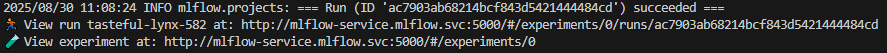
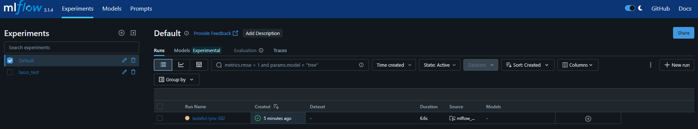

# Introduction
This repository contains Terraform code which:
- Creates AKS
- Generates a Dockerfile - Which can be used to run a container with prepared environment to interact with created AKS. From that container we can:
    - Deploy MLflow Tracking Server on AKS
    - Run MLflow project on AKS

For deploying MLflow Tracking Server and running MLflow project we will be using Helm charts from this repository, in the docker > helm_charts folder:
- mlflow_project - Running a project
- mlflow_setup - Deploying Tracking Server and preparing other resources needed to run the project

Both Helm charts will be copied to the container for interacting with AKS.

Further in this document we have the following main sections:
- Important notes before you use this repo - Read this first before start working with code from this repo
- Repository guide - How to use this code
- Prerequisites - What we need to do before we start using code from this repo
- MLflow setup Helm chart - Helm chart for deploying resources needed for deploying the MLflow Tracking Server and running MLflow project
- MLflow project - How do we prepare a MLflow project for training and evaluating model
- Docker container for interacting with AKS - More details about the Docker image created using the Dockerfile generated by Terraform
- Creating Azure resources with Terraform - What Azure resources we create using Terraform and how
- Problems and ideas for improvements

# Important notes before you use this repo
Here are important informations you need to know before you start working with this repo.

## Why to use Docker?
We are using here Docker to prepare environment to interact with AKS but it is not necessary to use it.

Instead of running a Docker container on our machine, we can prepare environment for interacting with AKS on our host machine itself.

If we have a Linux or MacOS, then we can take bash scripts from this Dockerfile and execute them on our machine.

## Sensitive data
Some files generated by Terraform will contain some sensitive data - credentials to a Service Principal used for authentication when interacting with AKS and ACR. Those files should be included in the .gitignore:
- Dockerfile
- values.yaml

# Repository guide
Here is described how to use code from this repository.

## Satisfying prerequisites
Before we start using this code we need to satisfy prerequisites described in the 'Prerequisites' section further in this document.

## Creating Azure resources and generating a Dockerfile
We need to create a few resources in Azure:
- AKS
- Storage Account
- ACR

Also we need to generate a few files which content depends on the created Azure resources:
- Dockerfile:
    - Used to run a container with prepared environment to interact with AKS
    - Saved in the docker folder
- values.yaml x2:
    - Two values.yaml files used in Helm charts:
    - Saved in the mlflow_project and mlflow_setup folders in the docker > helm_charts folder.

In order to create all those resources and generate files we need to run the following commands in the terraform folder:
>- terraform init # only when running Terraform for the first time in this repository
>- terraform plan -out main.tfplan
>- terraform apply main.tfplan

## Run a Docker container for interacting with AKS
Now we need to build a Docker image and run a container using the Dockerfile generated by Terraform. We can do that using the following commands (run them in the 'docker' folder):
>docker build -t aks .  # Build the image
>docker run -it aks     # Run the container

After running the container, it will:
- Trigger the script for building and pushing to ACR Docker images
- Start a bash session

Thanks to the '-it' option we will get access to the container's bash session from our terminal.

This container will be used to interact with AKS. From inside of it we will perform actions described in the next steps in this guide:
- Deploy MLflow Tracking Server on AKS
- Run MLflow project

## Deploy MLflow resources on AKS
Now from inside of the container we can deploy the MLflow Tracking Server and all the resources needed for running the MLflow project using Helm.

We do this by running the following commands in the /root/k8s/helm_charts > mlflow_setup directory:
>helm dependency update                             # <- Install dependency chart, i.e. MySQL (backend store)
>helm install mlflow . -n mlflow --create-namespace # <- Install the chart   

More information about what resources we are deploying here can be found further in this document in the 'MLflow setup Helm chart' section.

## Accessing MLflow Tracking Server website
We need to get a public IP of the Kubernetes Service which our Tracking Server Deployment is using:
>kubectl -n mlflow get svc mlflow-service

There will be written 'EXTERNAL-IP' which is our needed public IP.

We can access MLflow Tracking Server website using this URL:
>Public-IP:5000

## Upload MLflow project files to File share
File share need to contain MLflow project files to run and it will be mounted to the Job running the project.

We need to follow those steps:
- Go to the Storage Account created by Terraform (by default it will be called 'mlflowartifactsbulka' in the 'data_engineering_apps' resource group.)
- Go to File shares
- Go to the 'mlflow-projects' File share (that's the default name used by the Terraform code)
- Click on the 'Browse' tab
- Create a new folder called 'mlflow_project'
- Upload to this folder files from the mlflow_project folder from this repo

## Run MLflow project
Now we can run the MLflow project using Helm. We need to run the below command in the /root/k8s/helm_charts > mlflow_project directory:
>helm install run1 . -n mlflow

This will create a Job and a Pod called 'run1-mlflow-project-job-xxx'.

## Confirm the project has been completed successfully
In order to confirm that our project has been completed successfully, we can check logs of the Pod created by the Job we deployed using the Helm chart.

That Pod will be called `run1-mlflow-project-job-xxx` and we can check its logs using this command:
>kubectl -n mlflow logs run1-mlflow-project-job-xxx

We should see in those logs information like this:  

Also on the MLflow Tracking Server website we should see our run:  

## Destroying Azure resources
Once we are done, then in order to destroy all the created resources in Azure we need to run the following commands:
>terraform plan -destroy -out main.destroy.tfplan
>terraform apply main.destroy.tfplan

**Notes:**  
Sometimes deleting resources using Terraform doesn't work. In that case it is the best to delete resource groups manually from Azure website.

# Prerequisites
## Terraform variables
Before using this code we need to create terraform.tfvars file which look like terraform-draft.tfvars file in the same location. It is described there what values to provide. We are assigning there values to variables from the variables.tf file located in the same folder. In the variables.tf we can also find descriptions of those variables. We need to assign values only for those variables which doesn't have assigned the default value.

## Terraform configuration
We need to configure properly Terraform on our computer so it can create resources in our Azure subscription, it is described here: [developer.hashicorp.com](https://developer.hashicorp.com/terraform/tutorials/azure-get-started/azure-build).

## Azure subscription
We need to have a subscription on the Azure platform portal.azure.com.

# MLflow setup Helm chart
We use the Helm chart from the docker > helm_charts > mlflow_setup folder to deploy all the resources needed to run MLflow projects. There are 3 subfolders in the templates folder for deploying different resources:
- common - Common resources for both, deploying the Tracking Server and running MLflow project:
    - ACR Secret 
        - Created by the acr-secret.yaml template.
        - Contains value for authentication when pulling images from ACR.
        - Used by the Tracking Server deployment and in the Service Account used in the Job running MLflow project.
- mlflow_project - Resources needed specifically for running MLflow project (not related to the Tracking Server):
    - Volume claim
        - Created by the pvc.yaml template.
        - Used in the Job which runs MLflow project. It is linked to File share in Azure Storage Account and it provides project files to run.
    - Secret 
        - Created by the sa-secret.yaml template.
        - It is used by the Volume to authenticate when connecting to Storage Account.
    - Service Account 
        - Created by the service-account.yaml template.
        - Used in the Job which runs MLflow project. It enables reading a secret used for authentication when pulling images from ACR.
    - Role binding 
        - Created by the service-account-role-binding.yaml template
        - Assing proper permissions to the Service Account allowing for reading secrets.
- tracking_server - Resources used for deploying Tracking Server:
    - Volume Claim 
        - Created by the mysql-pvc.yaml template
        - Which will be used by MySQL which will act as a backend store. It will store data in Azure Disk (created on demand when deploying Volume claim).
    - Tracking Server Secret 
        - Created by the secret.yaml template
        - With values for connecting to MySQL (backend store) and Azure Storage Account (artifact store)
        - Used in the Tracking Server deployment
    - MLflow Tracking Server deployment
        - Created by the deployment.yaml template
        - Uses a secret for pulling image from ACR
        - Uses another secret for connecting to MySQL (backend store) and Azure Storage Account (artifact store)
        - Uses image from ACR pushed there from the container for interacting with AKS
        - Runs the `mlflow server` command to start the Tracking Server
    - Service
        - Created by the service.yaml template
        - Used to assign DNS name to the Tracking Server Pod

In the chart dependencies we have:
    - MySQL - Which will act as a backend store.

Everything will be running in the namespace we define. We install this chart by running the following commands in the /root/k8s/helm_charts > mlflow_setup directory:
>helm dependency update                             # <- Install dependency chart, i.e. MySQL (backend store)
>helm install mlflow . -n mlflow --create-namespace # <- Install the chart 

For deploying this chart we need:
- Docker image in ACR - Which can be prepared using the container for interacting with AKS. More info about that in the 'Docker container for interacting with AKS' section in this document.
- values.yaml file - Which can be generated by the Terraform code. More info about that in the 'Files generated by Terraform (using template files)' section in this document.

## Service Principal for ACR Secret
When creating the secret from this chart (templates > common > acr-secret.yaml) we need to use for username and password Service Principal's credentials which has a scope for our ACR and role 'acrpush'. It is required for proper authentication.

# MLflow project 
MLflow project files are saved in the mlflow_project folder in this repo. Here is shortly described how it works:
- Using the 'MLflow project' Helm chart we can deploy a Job which runs this project in a local mode.
- We save project files to run in a File share in Azure Storage Account and mount it to the Job running the project

In the below subsections we can find more details about it:
- **MLflow project Helm chart** - How the Helm chart works
- **MLpoject file** - How the MLproject file looks like, what entrypoints it contains and how they work
- **How to run multiple projects**
- **values.yaml** - How to prepare the values.yaml file for the Helm chart

## MLflow project Helm chart
In the docker > helm_charts > mlflow_project folder we have saved Helm chart used for running the MLflow project. It runs this project as a Job.

How to run a project using this chart:
- **MLflow run command**
    - In the values.yaml file in this chart we specify a command to run the MLflow project.
    - We run the project in a local mode since environment is prepared in the Docker image used for the Job running the project.
    - In this command we specify:
        - Which project to run
        - Which entrypoint to execute and with which parameters
        - Which experiment to assign the run to
- **Deploying a Job**
    - When we deploy this chart, it creates a Job which runs our MLflow project.
- **Mounted project files**
    - File share in Azure Storage Account created by Terraform is mounted to the Job running the project.
    - MLflow project files which we will run should be saved in this File share.
    - The path to the project to run, which we provide in the run command in the values.yaml file, should point to the project saved in the mounted File share.

Other important aspects of how this chart works:
- **Service Account**
    - When deploying a Job running the MLflow project, it uses the Service Account created by the 'MLflow setup' Helm chart.
    - This Service Account is used by the Job to read the Secret which contains value for authentication when pulling image from ACR.
- **Docker image**
    - It pulls a Docker image from ACR prepared when starting the container for interacting with AKS (more info in the 'Build and push to ACR Docker images' section).
    - It contains environment for running the project (Python installed and all the libraries used in the project)

## MLpoject file
In the MLproject file we have two entrypoints defined:
- train:
    - Run the train.py script
    - Train a model on a fake data generated in this script
    - Save the trained model in the artifact store in a specified experiment
- evaluate:
    - Run the evaluate.py script
    - Load the model from the latest run from the experiment specified by the experiment_name parameter
    - Evaluate the model
    - Log metrics in a new experiment (this experiment's name will be the same as the one specified by the experiment_name parameter but with the '_eval' suffix)

So if we want to train a model and then evaluate it, then:
- Run the train entrypoint with specified expieriment name
- Run the evaluate entrypoint with the experiment_name parameter set to the name of the experiment used for training

Instead of evaluating the latest trained model, we could save in a file a run ID of that trained model, read it in the script for evaluation and evaluate a model with this specific run ID.

## How to run multiple projects
When we install the chart for running MLflow project multiple time, we need to make sure that created Jobs will have a unique name.

After installing the chart, it will create a Job called '\<realese-name\>-\<chart-name\>', where:
- \<release-name\> is set up during installing the chart using command `helm install \<release-name\> \<project-path\> -n \<namespace\>`
- \<chart-name\> is set up in the Chart.yaml file

So in order to maintain unique names for created Jobs, we need to use different release name each time we install the chart.

## values.yaml
The values.yaml file is generated by Terraform (more info in the 'Files generated by Terraform (using template files)' section).

# Docker container for interacting with AKS
Terraform code will generate a Dockerfile and save it in the docker folder in this repository. Docker image created by this Dockerfile is used to:
- Build and push to ACR Docker images
    - It is done when starting a container
    - Those images will be used for deploying the MLflow Tracking Server and running the project
- Install Helm charts:
    - For deploying Tracking Server
    - For running MLflow project
- Interact with AKS using kubectl

In this image we are going to have:
- Installed Azure CLI - Which will be used to:
    - Get credentials to AKS (create the .kube/config file) what will enable using kubectl
    - Push images to ACR
- Installed and configured kubectl:
    - We will have prepared the .kube/config file used for authentication to AKS which enables us using kubectl.
- Installed Helm

## Build and push to ACR Docker images
When starting a container for interacting with AKS, the build_and_push.sh bash script will be executed which will build and push to ACR Docker images.

This script is using files from the docker > mlflow_docker folder (which is copied from the repo into the image). In this folder we have Dockerfiles for building images and other files used by those Dockerfiles.

We build two images:
- **Image for running MLflow project**
    - It contains Python installed and all the libraries used in the project
    - For building it we use the mlproject.Dockerfile and mlproject_requirementx.txt files
    - The mlproject_requirementx.txt contains Python libraries needed to run the project
- **Image for deploying MLflow Tracking Server**
    - For that we use the tracking-server.Dockerfile file
    - It has installed packages needed to run the Tracking Server which uses Azure Storage Account as an artifact store and MySQL as a backend store.

## Service Principal for permissions
When building this Docker image we will run the following Azure CLI commands:
- `az aks get-credentials` - To create the kubeconfig file (.kube/config). That will allow us to use kubectl to interact with our AKS cluster.
- `az acr build` - To build and push to ACR Docker images.

Running those commands requires proper permissions. That's why, when building this image, we need to login to Azure using `az login` using a Service Principal with proper roles and scopes:
- Role 'Contributor' with scope for ACR - Enable pushing images to ACR using the `az acr build` command
- Role 'Azure Kubernetes Service Cluster User Role' with scope for AKS - Enable getting credentials to AKS (creating .kube/config file) using the `az aks get-credentials` command

# Creating Azure resources with Terraform
This section explains what Azure resources and files we create using Terraform and how.

We have there the main.tf file which creates all the resources. That file uses modules defined in the terraform_linux_vm > modules folder. Each module is dedicated to creating one type of resource in Azure.

## Resources created
Resources which we create are:
- Two resource groups
- Log Analytics workspace - For AKS monitoring.
- AKS
- ACR - For storing Docker images used when deploying resources on AKS.
- Service Principal - It will be used in the Dockerfile generated by Terraform for authentication when interacting with AKS and ACR. It has the following scopes and roles:
    - Role 'acrpush' with scope for ACR - Enable pulling images from ACR when deploying resources on Kubernetes
    - Role 'Contributor' with scope for ACR - Enable pushing images to ACR using Azure CLI
    - Role 'Azure Kubernetes Service Cluster User Role' with scope for AKS - Enable getting credentials to AKS (creating .kube/config file)
      using the 'az aks get-credentials' command.
- Storage Account with:
    - Container - Which will act as an artifact store for MLflow Tracking Server.
    - File share - Where we will store MLflow project files and which will be mounted into the Job running MLflow project

## Files generated by Terraform (using template files)
Additionally Terraform saves files on the host where we run Terraform code:
- Dockerfile:
    - Used to run a container with prepared environment to interact with AKS
    - Saved in the docker folder
- values.yaml x2:
    - Two values.yaml files used in Helm charts:
    - Saved in the mlflow_project and mlflow_setup folders in the docker > helm_charts folder.

In the template_files folder we have templates of those files. We will interpolate them (insert variables values) and save on the localhost.

## Terraform outputs
Terraform creates multiple outputs with information about created resources. They are not needed to use code from this repo but might be useful in some situations. They can be accessed by running the command:
>terraform output

## Kubeconfig file
It is possible to use Terraform to save on our local machine a kubeconfig file when creating AKS but we don't do this since we generate a kubeconfig file in a Docker image using Azure CLI.

# Problems and ideas for improvements
## Kubeconfig not configured properly
Sometimes when running the container for interacting with AKS, kubeconfig file is not configured properly and we are not able to use kubectl to interact with AKS.

In that case it helps to run again, in the running container, code from the Dockerfile under this comment: 'Install Azure CLI and save credentials to AKS in the ~/.kube/config (kubeconfig) file'.

I don't know what this is about as this issue appears only sometimes. Maybe it is something about Docker caching.

## Helm charts deployment issue
Sometimes when we install the 'MLflow setup' Helm chart, it doesn't deploy all the resources and we need to try to install it again.